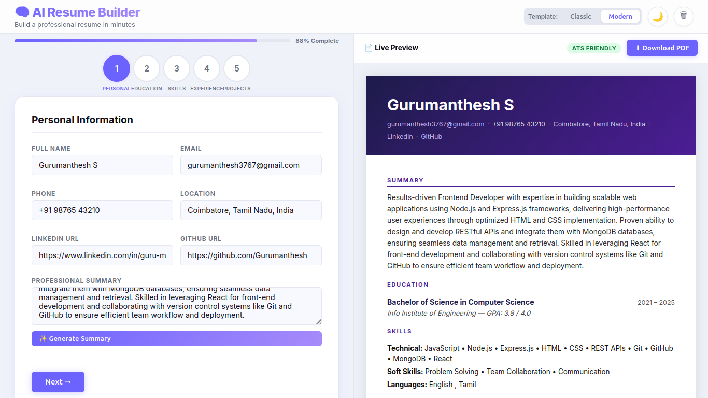
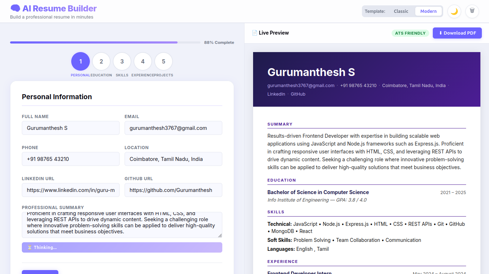

# 🧠 AI Resume Builder

<p align="center">


</p>

A **production-ready, full-stack AI-powered Resume Builder** that enables users to create professional resumes manually or with AI assistance. The application provides **live preview, ATS-friendly templates, PDF export, dark mode, and privacy-focused local AI integration using Ollama.**

---

# 🎥 Demo

> **Demo Video:** *(Add your LinkedIn/YouTube video link after uploading)*

## Screenshots

| Home | Live Preview |
|------|--------------|
|  |  |

| AI Features | Exported Resume |
|-------------|-----------------|
|  |  |

---

# 💡 Why I Built This

Many online resume builders either:

- Require expensive subscriptions
- Lock important features behind paywalls
- Store user data on remote servers
- Offer limited customization

I built **AI Resume Builder** to provide a **free, privacy-friendly, AI-assisted solution** that allows users to create professional resumes entirely on their own machine using **Ollama**.

---

# ✨ Features

## Resume Builder

- Multi-step guided resume creation
- Personal Information
- Education
- Skills
- Experience
- Projects
- Certifications
- Languages
- Interests

---

## 🤖 AI Features

- ✨ Generate Professional Summary
- ✨ Improve Experience Bullet Points
- ✨ Improve Project Description

Powered by **Ollama** using **Llama 3.1:8B** through an OpenAI-compatible API.

---

## 📄 Resume Preview

- Live Preview
- Real-time updates
- ATS-friendly formatting
- Clean typography
- Professional layout

---

## 🎨 UI Features

- Modern Responsive Design
- Dark Mode
- Light Mode
- Two Resume Templates
  - Classic
  - Modern

---

## 📥 Export

- One-click PDF Export
- High-quality printable resume
- ATS-friendly formatting

---

## 💾 Storage

- Browser Local Storage
- Automatic Save
- Restore Previous Session

No database is required.

---

## 🔒 Security

Designed with secure development practices.

- CSRF Protection
- XSS Sanitization
- CORS Restriction
- SSRF Prevention
- Payload Size Limits
- Secure Cookie Handling

---

# 🛠 Tech Stack

| Category | Technology |
|------------|------------|
| Frontend | HTML5, CSS3, Vanilla JavaScript |
| Backend | Node.js, Express.js |
| AI | Ollama (Llama 3.1:8B) |
| PDF Export | html2pdf.js |
| Storage | Browser LocalStorage |
| Security | csrf-csrf, cookie-parser, cors, express-rate-limit |
| Utilities | dotenv, compression, nodemon |

---

# 🏗 Architecture

```
                    User

                      │

                      ▼

            HTML • CSS • JavaScript

                      │

                      ▼

              Express.js Backend

                      │

      ┌───────────────┴───────────────┐
      │                               │
      ▼                               ▼

Resume APIs                    Security Layer
                               CSRF • XSS • CORS

                      │

                      ▼

          Ollama (Llama 3.1 : 8B)

                      │

                      ▼

         AI Generated Resume Content

                      │

                      ▼

      Live Preview + PDF Export
```

---

# 🚀 Quick Start

## 1. Clone Repository

```bash
git clone https://github.com/Gurumanthesh/ai-resume-builder.git

cd ai-resume-builder
```

---

## 2. Install Dependencies

```bash
npm install
```

---

## 3. Install Ollama

Download Ollama

https://ollama.com

Pull the required model

```bash
ollama pull llama3.1:8b
```

---

## 4. Configure Environment

Copy

```bash
cp .env.example .env
```

Example

```env
PORT=3000

CLIENT_ORIGIN=http://localhost:3000

OLLAMA_BASE_URL=http://localhost:11434/v1

OLLAMA_MODEL=llama3.1:8b

OLLAMA_API_KEY=ollama

CSRF_SECRET=your-long-random-secret
```

---

## 5. Run Application

Development

```bash
npm run dev
```

Production

```bash
npm start
```

Visit

```
http://localhost:3000
```

---

# 📁 Project Structure

```
AI-Resume-Builder/

│

├── client/

│ ├── index.html

│ ├── style.css

│ ├── app.js

│ └── html2pdf.min.js

│

├── server/

│ ├── server.js

│ ├── controllers/

│ ├── routes/

│ └── utils/

│

├── .env.example

├── package.json

└── README.md
```

---

# 🔌 API Endpoints

| Method | Endpoint | Purpose |
|----------|---------------------------|--------------------------------|
| GET | `/api/csrf-token` | Generate CSRF Token |
| POST | `/api/generate-summary` | AI Professional Summary |
| POST | `/api/improve-content` | Improve Resume Content |

---

# 🌍 Deployment

The project can be deployed on

- Railway
- Render
- VPS
- Docker

> **Note:** For cloud deployment, replace the local Ollama endpoint with an OpenAI-compatible hosted provider such as Groq, and configure the corresponding environment variables.

---

# 📌 Future Improvements

- Authentication
- Cloud Resume Storage
- Additional Resume Templates
- Job-specific Resume Tailoring
- Cover Letter Generator
- Multiple Language Support
- Resume Version History
- Resume Sharing via Link

---

# 🤝 Contributing

Contributions are welcome.

1. Fork the repository

2. Create a new branch

```bash
git checkout -b feature-name
```

3. Commit changes

```bash
git commit -m "Added new feature"
```

4. Push

```bash
git push origin feature-name
```

5. Open a Pull Request

---

# 📜 License

This project is licensed under the **MIT License**.

---

# 👨‍💻 Author

**Gurumanthesh S**

Computer Science Engineering Student

AI • Cybersecurity • Full-Stack Development

GitHub

https://github.com/Gurumanthesh

LinkedIn

https://www.linkedin.com/in/guru-manthesh

---

⭐ If you found this project helpful, consider giving it a **Star** on GitHub.
